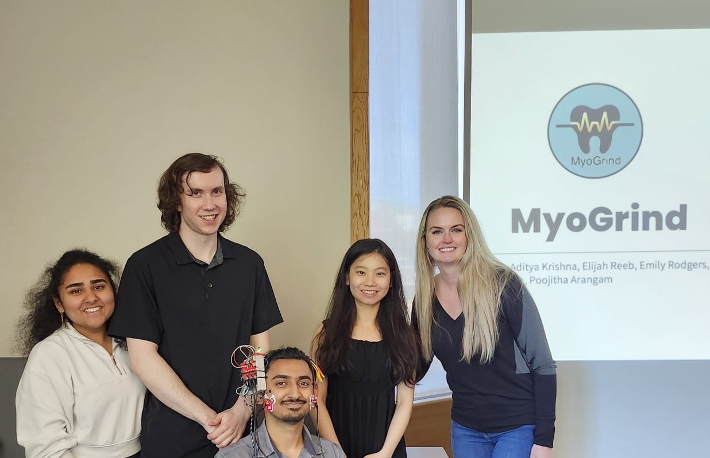

### Description:
The EE 461 Neural Engineering Tech Studio taught by Professor Kim Ingraham was a fantastic opportunity to study transdisciplinary engineering principles in designing a closed-loop neural engineering product. My group of 5 members came together and ideated a system that would help users manage and reduce their teeth grinding/clenching habits. 

Bruxism is a common condition consisting of teeth grinding/clenching which can lead to pain and dental damage. We wished to make a system that incorporated vibro-tactile stimulation to reduce teeth-grinding occurence. However, through interviews we conducted, we realized that many people suffering from Bruxism would find it very beneficial to even just be notified when they are teeth-grinding. This key information helped us pivot into designing a prototype that focused on simply notifying its users so they can manage their habits themselves.

Thus, we proposed and prototyped an EMG-based device that would detect teeth-grinding events and provide notifications over bluetooth along with vibro-tactile stimulation so users can be aware of their teeth-grinding habits and be directed towards the necessary measures to reduce their bruxism.

### Materials:
- Arduino Uno R4 WiFi
- MyoWare 2.0 Muscle Sensor Ecosystem
- LightBlue app for BLE notifications
- Electronics container, hairbands, and zip-ties

### GitHub Repository: 
https://github.com/aditya-uw/MyoGrind

### Our team won the showcase!

### Acknowledgements:
I want to first thank my group members for their incredible effort in this project. I also want to thank Professor Ingraham for teaching a great course and providing the opportunity to practice transdisciplinary design principles by ideating and prototyping a closed-loop neural product. Finally, I want to thank the ECE department for providing reimbursements for the expenses of our project.
